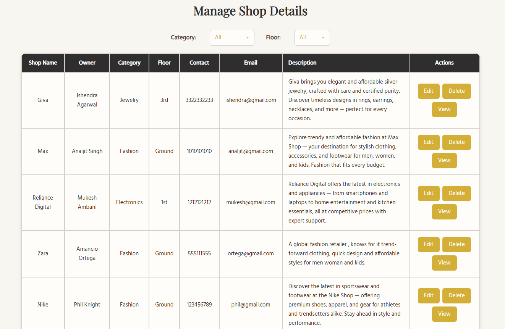

# Urbanova – Super Mall Web Application 🛍️  
**Tagline**: *Shop Your Heart Out*

---

## 📌 Project Overview

🛒 Urbanova – Shop Your Heart Out
Urbanova is a web-based Super Mall portal that helps local merchants, especially from rural areas, bring their shops online.

Merchants reach out to a mall admin, who adds their shop details, offers, and products on their behalf. Then, users can visit the site, browse shops, view offers, filter by category or floor, and even compare products — just like in a real mall, but online.

This project is designed to digitally connect small sellers to a global audience, creating a bridge between local commerce and modern digital shopping.

---

## 🔧 Technologies Used

- **Frontend**: HTML, CSS, JavaScript  
- **Database & Auth**: Firebase Firestore  
- **Animations**:
  - AOS.js on the Homepage
  - CSS animations in Admin and User panels

---
### 🔐 Login Credentials (Required)

To access the platform, use the following login credentials:

| Role   | Email                | Password   |
|--------|----------------------|------------|
| Admin  | `admin@example.com`  | `admin123` |
| User   | `user1@example.com`  | `user123`  |

> 🔒 Only these accounts are authorized to log in. New registrations are not enabled in this version.

## 🔍 Features / Modules

### 🔐 Login  
- Role-based login system for Admin and Users

### 🏪 Create Shop Details  
- Add new shops with category, floor, contact, description, etc.

### 🧾 Manage Shop Details  
- View, edit, or delete existing shop details  
- Filter shops by category and floor  
- Logging of edit/delete/view actions

### 🎁 Manage Offer Details  
- Edit or delete offers for shops  
- Visual comparison of selected offers  
- Logging of all changes

### 🗂️ Manage Category & Floor  
- View shops grouped by category or floor  
- Option to rename or delete categories/floors (not active by design)  
- Logging of actions

### 🧮 Category Wise Details  
- Display grouped shop details by selected category

### 🧾 List of Shop Details  
- View all shops in a single list  
- Filter by category or floor  
- (Includes search functionality & logging)

### 📃 List Offer Products  
- View all offer products grouped by shop  
- Toggle between categories or floors  
- Logging integrated

### 🆚 Compare Offers  
- Compare multiple offers side-by-side

### 🔍 Filter  
- Filter shops and offers using floor/category options

### 🏬 Shop Wise Offers  
- View all offers related to a specific shop

### 🧭 Floor Wise Details  
- See offers and shops grouped by floor

### 🔎 View Shop Details  
- Full detail view for individual shops  
- Integrated with external links for brand preview

---

## 🔒 Logging

Every user action (edit, delete, view, create) across modules is logged in Firestore (`logs` collection).  
The logger is modular via `logger.js` and used across all admin functions.

---
Super Mall/
├── README.md
├── html/
│   ├── index.html
│   ├── login.html
│   ├── admin.html
│   └── ... (other HTML files)
├── css/
│   ├── mainpage.css
│   ├── manageshop.css
│   └── ... (other CSS files)
├── js/
│   ├── firebase.js
│   ├── manageshop.js
│   └── ... (other JS files)
└── screenshots/
    ├── homepage.png
    ├── shopdetails.png
    └── ... (other screenshots)

## 🧭 Firebase Firestore Collections

- `shops` – All shop details  
- `offers` – Offer data for each shop  
- `product_offers` – Product-wise offer comparisons  
- `logs` – Logged actions (edit, delete, create, etc.)  
- `categories` – Category metadata  
- `floors` – Floor metadata  
- `roles` – (Optional) Role definitions

---

### 📸 Screenshots

#### 🏠 Home Page

#### 🛍️ Manage Shop Details

#### 🎁 Manage Offers

