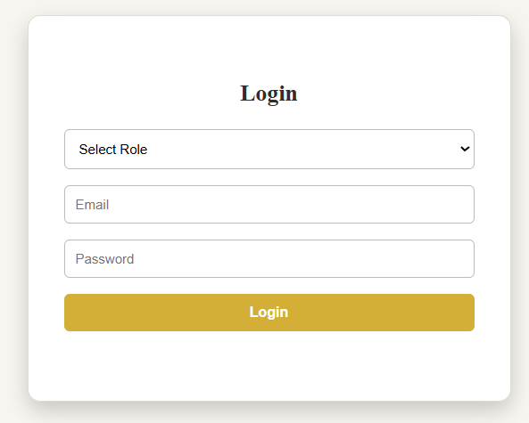
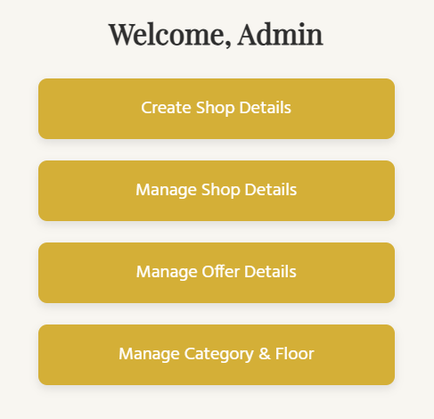
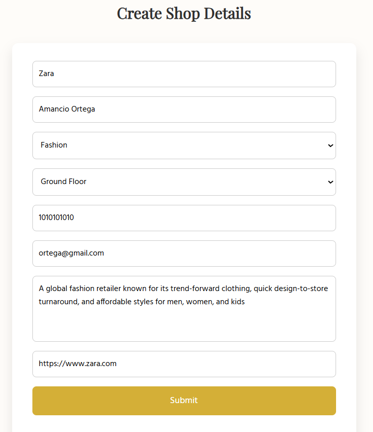
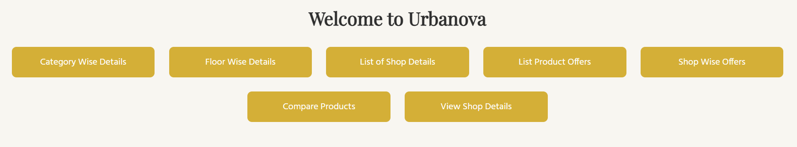
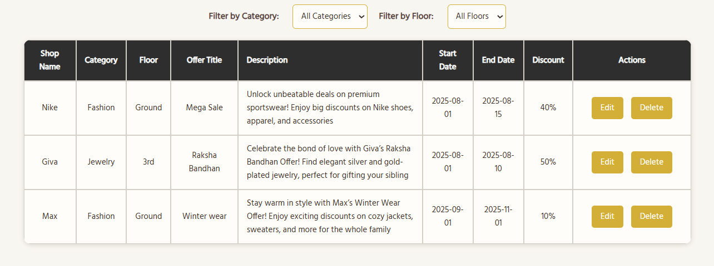
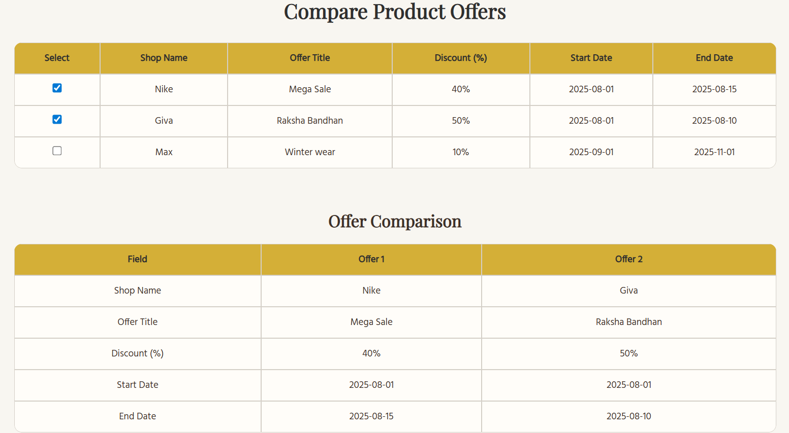

# Urbanova – Super Mall Web Application 🛍️  
**Tagline**: *Shop Your Heart Out*

---

## 📌 Project Overview

🛒 Urbanova – Shop Your Heart Out
Urbanova is a web-based Super Mall portal that helps local merchants, especially from rural areas, bring their shops online.

Merchants reach out to a mall admin, who adds their shop details, offers, and products on their behalf. Then, users can visit the site, browse shops, view offers, filter by category or floor, and even compare products — just like in a real mall, but online.

This project is designed to digitally connect small sellers to a global audience, creating a bridge between local commerce and modern digital shopping.

---

## 🔧 Technologies Used

- **Frontend**: HTML, CSS, JavaScript  
- **Database & Auth**: Firebase Firestore  
- **Animations**:
  - AOS.js on the Homepage
  - CSS animations in Admin and User panels

---
### 🔐 Login Credentials (Required)

To access the platform, use the following login credentials:

| Role   | Email                | Password   |
|--------|----------------------|------------|
| Admin  | `admin@example.com`  | `admin123` |
| User   | `user1@example.com`  | `user123`  |

> 🔒 Only these accounts are authorized to log in. New registrations are not enabled in this version.

## 🔍 Features / Modules

### 🔐 Login  
- Role-based login system for Admin and Users

### 🏪 Create Shop Details  
- Add new shops with category, floor, contact, description, etc.

### 🧾 Manage Shop Details  
- View, edit, or delete existing shop details  
- Filter shops by category and floor  
- Logging of edit/delete/view actions

### 🎁 Manage Offer Details  
- Edit or delete offers for shops  
- Visual comparison of selected offers  
- Logging of all changes

### 🗂️ Manage Category & Floor  
- View shops grouped by category or floor  
- Option to rename or delete categories/floors (not active by design)  
- Logging of actions

### 🧮 Category Wise Details  
- Display grouped shop details by selected category

### 🧾 List of Shop Details  
- View all shops in a single list  
- Filter by category or floor  
- (Includes search functionality & logging)

### 📃 List Offer Products  
- View all offer products grouped by shop  
- Toggle between categories or floors  
- Logging integrated

### 🆚 Compare Offers  
- Compare multiple offers side-by-side

### 🔍 Filter  
- Filter shops and offers using floor/category options

### 🏬 Shop Wise Offers  
- View all offers related to a specific shop

### 🧭 Floor Wise Details  
- See offers and shops grouped by floor

### 🔎 View Shop Details  
- Full detail view for individual shops  
- Integrated with external links for brand preview

---

## 🔒 Logging

Every user action (edit, delete, view, create) across modules is logged in Firestore (`logs` collection).  
The logger is modular via `logger.js` and used across all admin functions.

---
Super Mall/
├── README.md
├── html/
│   ├── index.html
│   ├── login.html
│   ├── admin.html
│   └── ... (other HTML files)
├── css/
│   ├── mainpage.css
│   ├── manageshop.css
│   └── ... (other CSS files)
├── js/
│   ├── firebase.js
│   ├── manageshop.js
│   └── ... (other JS files)
└── screenshots/
    ├── homepage.png
    ├── shopdetails.png
    └── ... (other screenshots)

## 🧭 Firebase Firestore Collections

- `shops` – All shop details  
- `offers` – Offer data for each shop  
- `product_offers` – Product-wise offer comparisons  
- `logs` – Logged actions (edit, delete, create, etc.)  
- `categories` – Category metadata  
- `floors` – Floor metadata  
- `roles` – (Optional) Role definitions

---

## ✅ Test Cases

| Feature                     | Action Performed                                  | Expected Outcome                                           | Status |
|-----------------------------|---------------------------------------------------|------------------------------------------------------------|--------|
| Login - Admin               | Enter correct email & password                    | Redirects to admin dashboard                               | ✅     |
| Login - Invalid User        | Enter wrong credentials                           | Shows login error                                          | ✅     |
| Create Shop Details         | Fill and submit all fields                        | Shop gets added and form resets                            | ✅     |
| Manage Shop Details         | Edit/Delete/View buttons                          | Performs corresponding action and updates table            | ✅     |
| Manage Offer Details        | Edit/Delete buttons                               | Updates or deletes offers correctly                        | ✅     |
| Manage Category & Floor     | View category/floor-wise shop grouping            | Displays shops grouped correctly                           | ✅     |
| Category Wise Details       | Select a category                                 | Shows only shops under selected category                   | ✅     |
| List of Shop Details        | Apply floor/category filters                      | Filters shop list as expected                              | ✅     |
| Shop Wise Offers            | Select shop from dropdown                         | Shows offers related to that shop                          | ✅     |
| Floor Wise Details          | Select floor from dropdown                        | Displays only shops available on selected floor            | ✅     |
| Product Comparison          | Select multiple offers to compare                 | Displays side-by-side comparison                           | ✅     |
| Logging                     | Perform any action (edit/delete/view)             | Entry created in `logs` collection in Firestore            | ✅     |
| Responsive UI               | Open on mobile/tablet/laptop                      | Layout adapts properly across all screen sizes             | ✅     |
| Animations                  | Load index/admin/user pages                       | AOS or CSS animations visible                              | ✅     |

## 🌐 Live Demo

You can view the live hosted version of **Urbanova – Shop Your Heart Out** here:

🔗 [Urbanova Live Site](https://shrau1405.github.io/Urbanova/html/index.html)

This deployment ensures easy access for merchants and users to explore the Super Mall features online.
---
### 📸 Screenshots

#### 🏠 Home Page

#### 🏠 Login Page

#### 🏠 Admin Page

#### 🏠 Create Shop Page

#### 🛍️ Manage Shop Details Page

#### 🏠 User Page

#### 🏠 Shop Wise Details Page

#### 🏠 Compare Page

